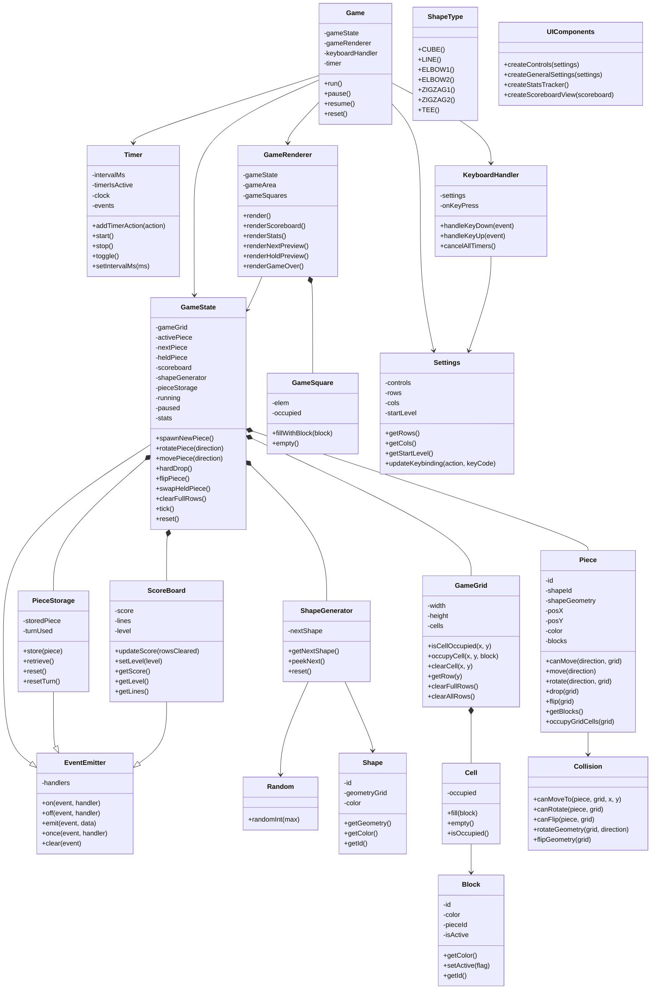
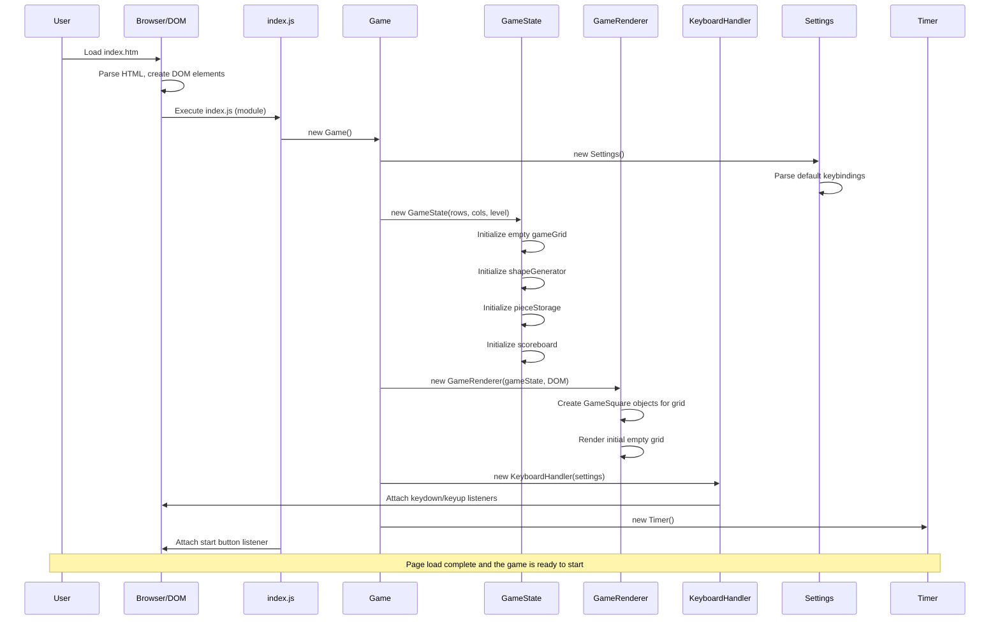
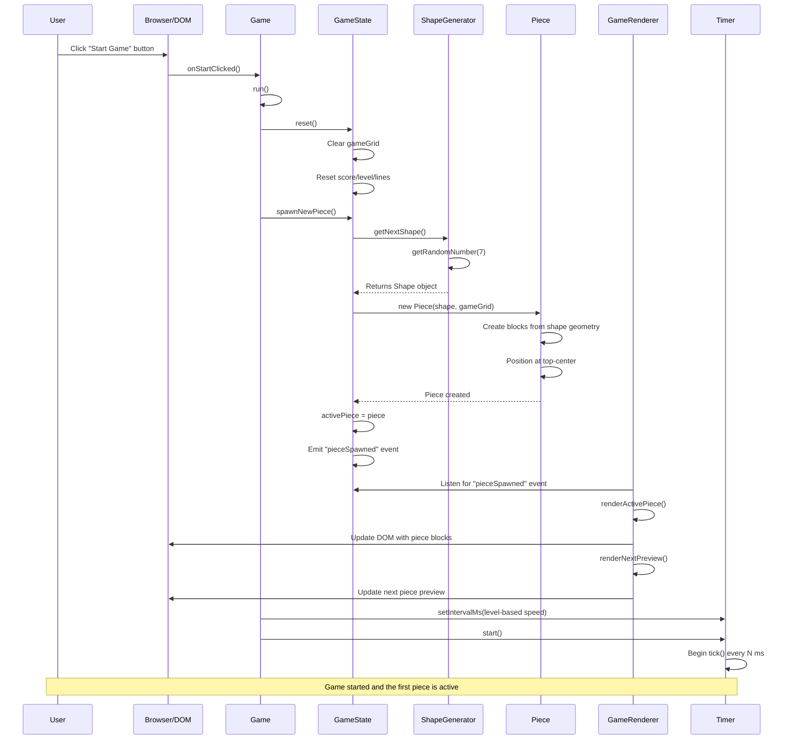
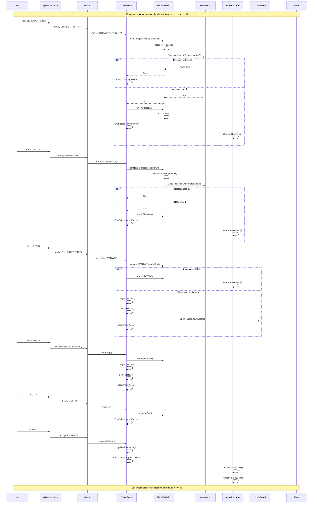
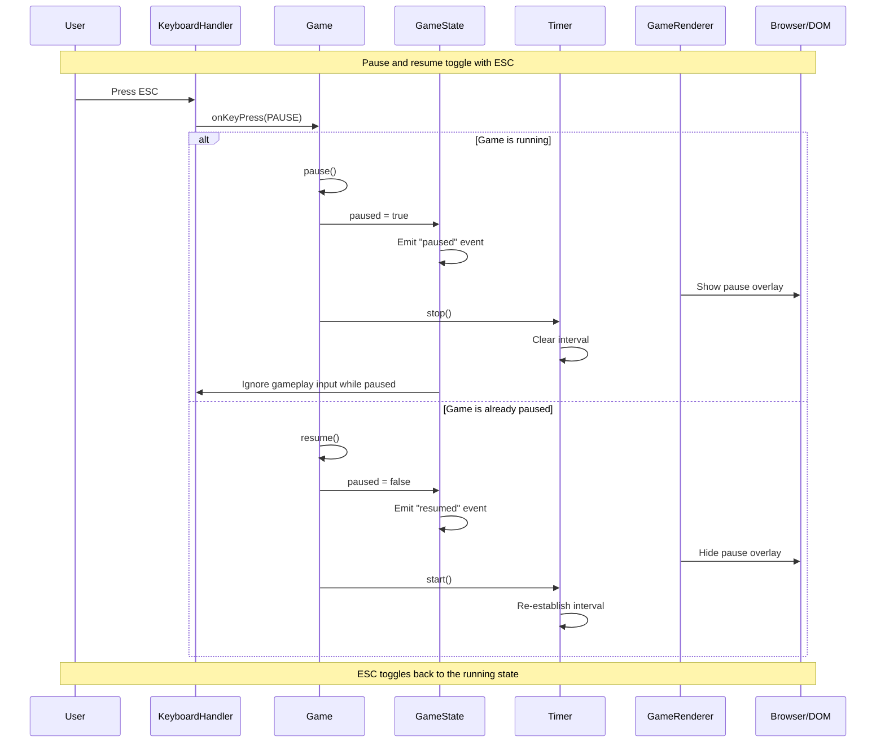

# Tetris Design And Architecture

## Overview

This is basically a tetris clone. I added a "flip" feature to appease my ADD, making it easier to make sure there
are no holes on the board. Yes, that makes the game easier too; the feature can be disabled by unassigning the keyboard shortcut, or simply not using it, ...or, you know, writing your own clone.

The game board is pure HTML because, at the time this was created that was the only option. I have no plans to update because moving to canvas would force me to create a whole infrastructure for rendering squares on a surface, and, well, HTML seems quite adept at that.

The statistics section was added to help improve the randomness algorithm, which in early versions relied on `Math.random()` which, it turns out, really isn't all that random and would "glom on" to particular pieces and put them out at might higher (and lower) rates than others. For a time this was remedied with an ALEA Randomisation algorithm, but that was subsequently replaced as the language evolved and now seems to work fine with JavaScript's `crypto` interface.

### Scoring Points

Scoring is handled by `ScoreBoard.updateScore(rowsCleared)`. Points earned are scaled based on the number of points scored, encouraging players (well, me...) to accumulate rows to maximize their score.

Algorithm:
    `pointsAwarded = factorial(rowsCleared) * 100`

This yields per-clear point values:
- 1 line: 1! * 100 = 100
- 2 lines: 2! * 100 = 200
- 3 lines: 3! * 100 = 600
- 4 lines: 4! * 100 = 2400

### Drop Speed Per Level

Every time 10 lines are cleared the level is raised and the piece drop rate is increased. Automatic falling speed
is computed by `Game._calculateTimerSpeed()` and applied via `Timer.setIntervalMs(...)`. Lower interval means faster
falling.

The initial version of this game used scaled drop speed using linear interpolation. This was very challenging; there
was almost no perceivable difference between levels 1 and 7, but after that the game became very hard, very fast.
The drop rate now follows a Pseudo‑logarithmic scale because it turns out that people perceive time differences
logarithmically!

Algorithm:

1. Read current level from scoreboard.
2. Use constants:

    `maxTimeout = 1000 (ms)`

3. Compute asymptote term:

    `asymptote = (15 / -level) + (15 - 0.5)`

4. Compute interval in milliseconds:

    `intervalMs = maxTimeout * (15 - asymptote) / 15`

5. When level changes, re-apply the computed interval to the running timer.

Equivalent simplified form:

`intervalMs = 1000 * ((0.5 + 15 / level) / 15)`

Examples:

- Level 1: about 1033 ms
- Level 5: about 233 ms
- Level 10: about 133 ms
- Level 15: about 100 ms

## Three-Layer Design

The rest of this document is AI generated. The pictures really helped me understand the design I came up with all those years (decades..!) ago. It is not as bad as I thought it would be! The current design follows the original's and preserves the original logic and (really very ugly) styling for the most part, but with more modern conventions/language constructs (e.g. `class`, `import ...`, etc.).

### Layer 1: Core (src/core)

- EventEmitter.js: lightweight pub/sub event system
- Random.js: random number generation
- Timer.js: game tick timer
- Game.js: controller that wires state, renderer, input, and timer

Dependencies: none

### Layer 2: Game Logic (src/game)

- Shape and ShapeType define tetromino geometry and color
- GameGrid and Cell track occupancy
- Block and Piece model active and placed blocks
- Collision validates movement and transforms geometry
- ShapeGenerator produces upcoming pieces
- PieceStorage manages hold behavior
- ScoreBoard manages score, lines, and level
- GameState is the central state machine and event source

Dependencies: core only

### Layer 3: UI Rendering (src/ui)

- GameSquare renders one grid cell
- GameRenderer listens to game-state events and updates DOM
- KeyboardHandler captures keyboard input
- Settings stores keybindings and game settings
- UIComponents builds controls and settings UI

Dependencies: game logic

## Class Diagram

## Event Flow

User input or timer tick triggers Game methods, Game delegates to GameState, GameState mutates state and emits events, and GameRenderer updates the DOM by listening to those events.

## Sequence Diagrams

### 1. Page Load

The page bootstraps the modular game controller, creates the logic layer, then wires the renderer and keyboard handler to the DOM.

### 2. Game Start

Starting the game resets logic state, spawns the first piece, refreshes the previews, and begins the falling timer.

### 3. Player Moves

Player actions all route through the same controller path, with GameState owning legality checks, state mutation, scoring, and row clearing.

### 4. Pause And Resume

The pause flow stops the timer, shows the overlay, and blocks gameplay input until the player resumes.

## Statistics Piece-Appearance Chart

The statistics panel includes a bar chart for visual piece-frequency comparison.

- Data source: gameState.stats.pieceCounts and gameState.stats.piecesPlaced
- Render location: GameRenderer.renderStats()
- Scaling: each bar height is normalized against the highest current piece count
- Visual mapping: seven fixed bars (shape IDs 0-6), color-matched to tetromino types
- Update trigger: chart is rebuilt whenever GameRenderer.render() runs